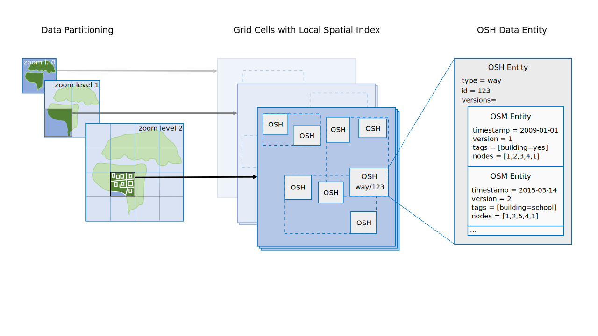

OSHDB - OpenStreetMap History Data Analysis
===========================================

High-performance spatio-temporal data analysis platform for OpenStreetMap full-history data. Developed by [HeiGIT](https://heigit.org).


[](https://jenkins.ohsome.org/blue/organizations/jenkins/oshdb/activity/?branch=master)

The OSHDB allows to investigate the evolution of the amount of data and the contributions to the OpenStreetMap project. It combines easy access to the historical OSM data with high querying performance. Use cases of the OSHDB include data quality analysis, computing of aggregated data statistics and OSM data extraction.

```java
    OSHDBDatabase oshdb = /*…*/;

    Integer numberOfUsersEditingHighways = OSMContributionView.on(oshdb)
        .timestamps("2007-10-07", "2009-04-09")
        .osmTag("highway")
        .map(contribution -> contribution.getContributorUserId())
        .countUniq();
        
    System.out.println(numberOfUsersEditingHighways);
```

The main functionality of the OSHDB is explained in the [first steps tutorial](documentation/first-steps/README.md).

OpenStreetMap History Data
--------------------------

[OpenStreetMap](https://www.openstreetmap.org/) contains a large variety of geographic data, differing widely in scale and feature type. OSM contains everything from single points of interests to whole country borders, from concrete things like buildings up to more abstract concepts such as turn restrictions. OSM also offers metadata about the [history](https://wiki.openstreetmap.org/wiki/Planet.osm/full) and the modifications that are made to the data, which can be analyzed in a multitude of ways.

Because of it's size and variety, possibilities of working with OSM history data are limited and there exists a lack of an easy-to-use analysis software. A goal of the OSHDB is to make OSM data more accessible to researchers, data journalists, community members and other interested people.

Central Concepts
----------------

The OSHDB is designed to be appropriate for a large spectrum of potential use cases and is therefore built around the following central ideas and design goals:

* _Lossless Information_: The full OSM history data set should be stored and be queryable by the OSHDB, including errorneous or partially incomplete data.
* _Simple, Generic API_: Writing queries with the OSHDB should be simple and intuitive, while at the same time flexbile and generic to allow a wide variety of analysis queries.
* _High Performance_: The OSM history data set is large and thus requires efficiency in the way the data is stored and in the way it can be accessed and processed.
* _Local and Distributed Deployment_: Analysis queries should scale well from data explorations of small regions up to global studies of the complete OSM data set.

The OSHDB splits data storage and computations. It is then possible to use the [MapReduce](https://en.wikipedia.org/wiki/MapReduce) programming model to analyse the data in parallel and optionally also on distributed databases. A central idea behind this concept is to bring the code to the data.

### Data Model

The OSHDB uses it's own binary data format that encapsulates the OSM history data available from [planet.osm.org](https://planet.osm.org/) and is optimized for efficient storage and access to the history data. In order to allow parallelized data processing, the OSHDB data model also includes a data partitioning scheme.

[](documentation/manual/data-model.md)

See the [data model](documentation/manual/data-model.md) section of the documentation for further information about the OSHDB data model.

### API

The OSHDB offers a flexible, simple and intuitive application programming interface that provides helpful abstractions on top of the offered OSM data entities. It provides different **views** on the OSM history data that allow to either investigate the OSM data at specific points in time (as snapshots), or to investigate all contributions to the OSM data in their entirety. The OSHDB API also allows to filter the OSM data by arbitrary regions, time ranges and OSM properties such as tags, entity type, etc.

The API is based on the MapReduce programming model and offers powerful methods to aggregate and analyze the OSM history data. The OSHDB API is described in detail in the [api section](documentation/manual/api.md) of the documentation.

Installation
------------

The OSHDB is available as a pre-compiled maven library and can be incorporated easily in any maven project. If you're starting a new project, take a look at how your IDE handles maven projects (for example, here you find instructions how to create a new maven project using [IntelliJ](https://www.jetbrains.com/help/idea/maven-support.html#maven_create_project)). Our [first steps tutorial](https://github.com/GIScience/oshdb/tree/docu-update-cleanup/documentation/first-steps#2-add-maven-dependency) includes further information about how to add the OSHDB as a maven dependency to your projects.

Documentation
-------------

* [first steps tutorial](documentation/first-steps/README.md)
* [User Manual](documentation/manual/README.md)
* [OSHDB Javadoc](https://docs.ohsome.org/java/oshdb/0.5.11/aggregated/)

Examples
--------

A few usage examples can be found in our [oshdb-examples](https://gitlab.gistools.geog.uni-heidelberg.de/giscience/big-data/ohsome/oshdb-examples) repository.

Publications and Presentations
------------------------------

* Raifer, Martin; Troilo, Rafael; Kowatsch, Fabian; Auer, Michael; Loos, Lukas; Marx, Sabrina; Przybill, Katharina; Fendrich, Sascha; Mocnik, Franz-Benjamin; Zipf, Alexander (2019): [**OSHDB: a framework for spatio-temporal analysis of OpenStreetMap history data**](https://doi.org/10.1186/s40965-019-0061-3). Open Geospatial Data, Software and Standards.
* Auer, Michael; Eckle, Melanie; Fendrich, Sascha; Kowatsch, Fabian; Marx, Sabrina; Raifer, Martin; Schott, Moritz; Troilo, Rafael; Zipf, Alexander (2018): [Comprehensive OpenStreetMap History Data Analyses- for and with the OSM community](https://2018.stateofthemap.org/2018/A33-Comprehensive_OpenStreetMap_History_Data_Analyses-_for_and_with_the_OSM_community/). Talk at the State of the Map conference 2018, Milan.
* Auer, Michael; Eckle, Melanie; Fendrich, Sascha; Kowatsch, Fabian; Loos, Lukas; Marx, Sabrina; Raifer, Martin; Schott, Moritz; Troilo, Rafael; Zipf, Alexander (2018): [Ohsome – eine Plattform zur Analyse raumzeitlicher Entwicklungen von OpenStreetMap-Daten für intrinsische Qualitätsbewertungen](https://gispoint.de/gisopen-paper/4514-ohsome-eine-plattform-zur-analyse-raumzeitlicherentwicklungen-von-openstreetmap-daten-fuer-intrinsische-qualitaetsbewertungen.html?IDjournalTitle=5). AGIT ‒ Journal für Angewandte Geoinformatik.
* Auer, Michael; Eckle, Melanie; Fendrich, Sascha; Griesbaum, Luisa; Kowatsch, Fabian; Marx, Sabrina; Raifer, Martin; Schott, Moritz; Troilo, Rafael; Zipf, Alexander (2018): [Towards Using the Potential of OpenStreetMap History for Disaster Activation Monitoring](https://www.researchgate.net/publication/325397280_Towards_Using_the_Potential_of_OpenStreetMap_History_for_Disaster_Activation_Monitoring). Conference: Proceedings of the 15th ISCRAM Conference 2018, Rochester.
* Raifer, Martin (2017): [OSM history analysis using big data technology](https://2017.stateofthemap.org/2017/osm-history-analysis-using-big-data-technology/). Talk at the State of the Map conference 2017, Aizuwakamatsu.

See Also
--------

Projects using the OSHDB:

* **https://api.ohsome.org**<br>A web api for executing common queries on OSM history data
* https://osm-measure.geog.uni-heidelberg.de/about<br>A reasearch project about data quality measures related to OSM data.

Other projects analyzing OSM history data:

* https://github.com/MaZderMind/osm-history-renderer
* https://github.com/zehpunktbarron/iOSMAnalyzer
* https://github.com/mojodna/osm2orc
* https://github.com/mapbox/osm-wayback, https://mapbox.github.io/osm-analysis-dashboard/
* https://osmstats.stevecoast.com


