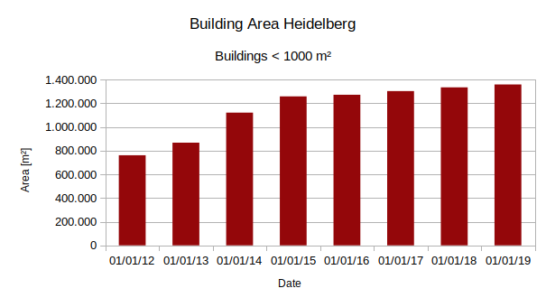

# Tutorial: First Steps using the OSHDB-API

The _OSHDB-API_ is a Java-API that allows one to run queries on the OSM history data.

The programming interface is based on the [MapReduce](https://en.wikipedia.org/wiki/MapReduce) programming model which divides any analysis into different steps:

* OSM data is searched spatially, temporally and by its attributes.
  <br><i>example: return all OSM ways which are tagged as "building" in a specific area in yearly steps between 2012 and 2019</i>
* Intermediate results are calculated for each OSM entity at each requested timestamp
  <br><i>example: return the building's footprint area</i>
* The final result is calculated by combining the intermediate results together using one of the aggregation methods provided by the OSHDB-API.
  <br><i>example: calculate the sum of the values generated in the previous step.</i>

This _first steps_ tutorial will guide you through each of these steps individually.

## 1. Download an oshdb extract

For your first steps, we recommend that you download one of the available OSHDB data extracts from our [download server](https://downloads.ohsome.org/v0.6/). We will use this data file to run a simple analysis query on it.

## 2. Add maven dependency

If you already have an existing Java maven project, the OSHDB-API can be added to the project by including it in the dependencies of the project's `pom.xml` file:    

```xml
<dependency>
  <groupId>org.heigit.ohsome</groupId>
  <artifactId>oshdb-api</artifactId>
  <version>0.6.2</version>
</dependency>
```

Note that the OSHDB requires Java 11, so it could sometimes be necessary to specify this additional restriction in the `pom.xml` as well. Take a look at this [example `pom.xml`](./example-pom.xml) file that shows how all these settings should be put together.

If you're starting a new OSHDB project from scratch, it's typically a good idea to create a new maven project using the "create new project" wizard of your IDE of choice. After that you can use the steps described above to add OSHDB as a dependency to the new project.

## 3. Start writing the OSHDB query

Now, we're ready to go and use the OSHDB to query the OSM history data. If we're starting a new standalone OSHDB query, it makes sense to add a main class and function to the project now. There, we create a new OSHDB database connection:

```java
OSHDBDatabase oshdb = new OSHDBH2("path/to/extract.oshdb");
```

## 4. Select OSHDB view

The next step is to decide which kind of analysis we want to perform on the OSM history data. Two different analysis views are provided by the OSHDB:

* The *snapshot view* returns the state of the OSM data at specific points in time. This view is for example useful to determine how the amount of OSM data (such as the length of the road network, or the number of buildings) changed over time.
* The *contribution view* returns all modifications (e.g. creations, modifications or deletions) to OSM elements within a given time period. This view can be used to get information about the number of OSM contributors editing the OSM data.

We will use the snapshot view in this tutorial, but the contribution view can be used in a very similar manner.

```java
OSMEntitySnapshotView.on(oshdb)
```

Note that this is not yet a complete JAVA code line. It will be extended in the following steps to include statements that filter, transform and aggregate the OSM history data.

## 5. Setting spatial and temporal extents

Every query must specify a spatial extent and a timestamp (or time range) for which the OSM data should be analyzed. This can be done by calling the methods `areaOfInterest` and `timestamps` on the object we got from the View in the previous step. The spatial extent can either be defined as a rectangular bounding box, or as an arbitrary polygonal [JTS](https://projects.eclipse.org/projects/locationtech.jts) geometry object. In our example, we will use a simple bounding box. The timesteamp can be defined by providing a date-time string.

```java
    .areaOfInterest(new OSHDBBoundingBox(8.6634, 49.3965, 8.7245, 49.4268))
    .timestamps("2019-01-01")
```

Note that the OSHDB expects (and returns) coordinates in the cartesian XY order: longitude first, then latitude. So, the parameters for specifying a bounding box in the OSHDB are in the following order: left, bottom, right, top (or: west, south, east, north). Just like the OpenStreetMap data, the OSHDB also works directly with coordinates in WGS84 coordinates ([EPSG:4326](https://epsg.io/4326)) of longitude and latitude. To quickly get the coordinates of a bounding box in this format, we recommend the following online tool: http://norbertrenner.de/osm/bbox.html

For now, we only define a single timestamp in our query. But the OSHDB also supports querying the OSM history data for multiple timestamps at once. For example, one can analyze the data in yearly steps between 2012 and 2019. At the end of this tutorial we will show what (few) changes are necessary to let our query generate the results for many timestamps at once.

## 6. Filtering OSM data

There are several different ways to select a specific subset of the OSM dataset. In our example, we only want to look at OSM way objects which have the `building` tag. To filter these objects for our query, we add the following statements to our query:

```java
    .osmType(OSMType.WAY)
    .osmTag("building")
```

There are other variants of these methods and a few more, all work in a similar way: one specifies which OSM objects should be keept. Multiple filters can be specified one after each other, resulting in the set of OSM objects that match all of the selectors (i.e. an **and** operation). 

## 7. Calculating intermediate results

Now we can access the properties of all the OSM way objects that have the `building` tag. Since we specified the snapshot view, each matching OSM objects will potentially be returned multiple times: once for each timestamp we requested.

In a so called `map` step (of the MapReduce programming model), where these snapshot objects can be accessed and transformed to any result one desires. For example, we can calculate the area of an OSM object's geometry in the following way.

```java
    .map(snapshot -> Geo.areaOf(snapshot.getGeometry()))
```

## 8. Filtering intermediate results

One can optionally also filter the intermediate results generated in the map step. This can be used for many different queries, but here, we use this to filter out outliers in the data (i.e. buildings that are larger than a fixed value of 1000&nbsp;m²).

```java
    .filter(area -> area < 1000.0)
```

## 9. Requesting aggregated result

Now we only have to do one final operation, which is letting the OSHDB know how it should aggregate the intermediate results into a final result value. There are several predefined functions available for this, for example `sum`, `average`, `count`, `countUniq`, …. This is the `reduce` step of the MapReduce programming model.

```java
     .sum();
```

Calling this function will instruct the OSHDB to start the processing of the OSM history data, apply all filter, transformation (map) and aggregation (reduce) functions and will return the final result.

## 10. Summary

To summarize, here is the code of our first query:

```java
OSHDBDatabase oshdb = new OSHDBH2("path/to/extract.oshdb");
Number result = OSMEntitySnapshotView.on(oshdb)
    .areaOfInterest(new OSHDBBoundingBox(8.6634,49.3965,8.7245,49.4268))
    .timestamps("2019-01-01")
    .osmType(OSMType.WAY)
    .osmTag("building")
    .map(snapshot -> Geo.areaOf(snapshot.getGeometry()))
    .filter(area -> area < 1000.0)
    .sum();
System.out.println(result);
```

This example prints the result (approximately `1360069.5`) to the terminal console. Alternatively, it could also be stored in a file, database or be used to generate graphics.

## 11. Multiple Timestamps

As mentioned earlier in this tutorial, the OSHDB also allows one to generate results for multiple timestamps at once. To achieve this, a few changes are necessary to our query: First, we have to actually tell the OSHDB to query more than one timestamp. One can for example specify a start and end date with regular time interval: `.timestamps("2012-01-01", "2019-01-01", Interval.YEARLY)`. Then, we have to tell the OSHDB that we want our result for each timestamp individually. We do this by calling `.aggregateByTimestamp()` at some point in our query, before the final reduce operation is executed. This will change the data type of the result of our query from being a single number, to an object that contains an individual number result for each timestamp:

```java
OSHDBDatabase oshdb = new OSHDBH2("path/to/extract.oshdb");
SortedMap<OSHDBTimestamp, Number> result = OSMEntitySnapshotView.on(oshdb)
    .areaOfInterest(new OSHDBBoundingBox(8.6634,49.3965,8.7245,49.4268))
    .timestamps("2012-01-01", "2019-01-01", Interval.YEARLY)
    .osmType(OSMType.WAY)
    .osmTag("building")
    .map(snapshot -> Geo.areaOf(snapshot.getGeometry()))
    .filter(area -> area < 1000.0)
    .aggregateByTimestamp()
    .sum();
System.out.println(result);
```

The result from this query is visualized in the following graph:



## 12. Next steps

That's it for our first-steps tutorial. Of course there are many more options and features to explore in the OSHDB. For example how the contibution [view](../manual/views.md) let's you analyze each modification to the OSM objects individually, more advanced [filtering](../manual/filters.md) options, or other concepts like the [`flatMap`](../manual/map-reduce.md#flatmap) function, custom [`aggregateBy`](../manual/aggregation.md) and [`reduce`](../manual/map-reduce.md#reduce) operations, etc.
