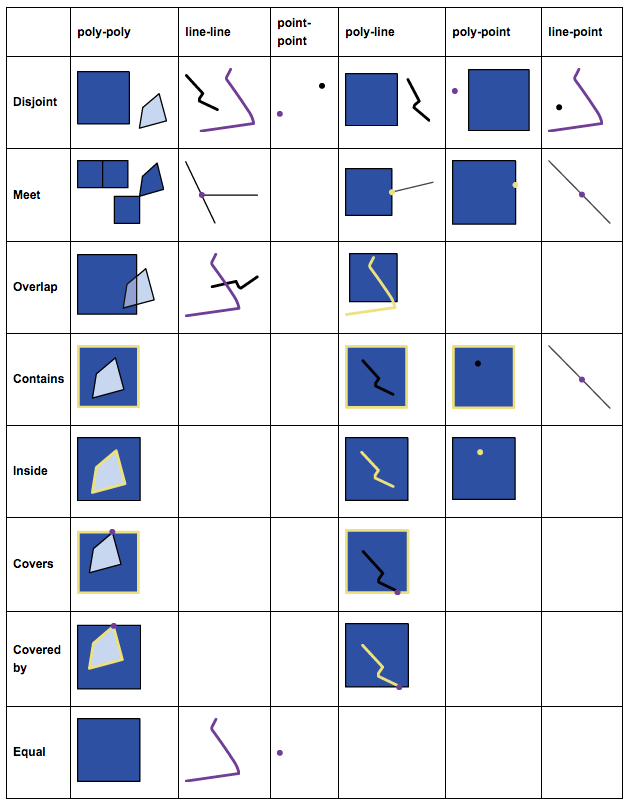

# Querying by Spatial Relation

Using the `MapReducer` and `MapAggregator` classes, `OSMEntitySnapshots` and `OSMContributions` can be queried based on spatial relations to other surrounding features. 

## Egenhofer Relations

The spatial relations were implemented as defined by [Egenhofer (1993)](https://pdfs.semanticscholar.org/4f86/eb645cd4e3d0588dbccb48f445127061cf08.pdf). Figure 1 gives a graphical representation of each type of relation. In addition, features can be queried based on neighbouring features which are disjoint from the central feature.  

__Note:__ These definitions are different from the ones implemented by the `Geometry` class in Java. 

<div style="text-align:center"></div>
<div style="text-align:center"><i>Figure 1: Spatial relations as defined by Egenhofer (1993).
<a href="http://www.gitta.info/SpatialQueries/en/html/TopoBasedOps_learningObject1.html">(source)</a>
</i></div>


## General query structure   

There are two ways for querying `OSMEntitySnapshots` and `OSMContributions` based on spatial relations. They can be filtered by comparing them to the geometries of surrounding features. Alternatively, a list of all surrounding features that fulfill a specific spatial relation is returned for each `OSMEntitySnapshots` or `OSMContributions`. The following methods are implemented for both `MapReducer` and `MapAggregator` classes.

|Filter | Map|
|------|---|
|`contains()`|`containment()`| 
|`covers()`|`coveredFeatures()`|
|`coveredBy()`|`coveringFeatures()`|
|`equals()`|`equalFeatures()`|
|`overlaps()`|`overlappingFeatures()`|
|`touches()`| `touchingFeatures()`|
|`inside()`|`enclosingFeatures()`|
|`neighbouring()`|`neighbourhood()`|

The "filter" methods filter the features of the MapReducer by comparing their geometry to the ones of other surrounding features. The "map" methods return a Pair object whose first element is the current object of the MapReducer and the second element is a list of features in the surrounding area that match the respective spatial relation.

The relation `disjoint()` is not implemented as such. Instead the methods `neighbouring()` and `neighbourhood()` can be used along with a distance parameter that specifies the search radius for finding disjoint features. 

__Relations:__ The geometry of relations is stored as Multi-Polygons or Multi-Linestrings. There are merged using a union operation to determine the spatial relation to anothe feature. 
 
### Specification of the surrounding features 

There are three different methods of how to specify/filter the surrounding features to which the current object of the MapReducer is compared to. 

####1. Callback function
__Example:__ Get all parks along with a list of trees they contain

```
List<Pair<OSMEntitySnapshot, List<OSMEntitySnapshot>> result = MapReducer
  .osmTag("leisure", "park")
  .containedFeatures(mapReduce -> mapReduce.osmTag("natural", "tree").collect())
  .collect();
```
__Example:__  Get all parks that contain at least one tree

```
List<OSMEntitySnapshot> result = MapReducer
  .osmTag("leisure", "park")
  .contains(mapReduce -> mapReduce.osmTag("natural", "tree").collect())
  .collect();
```
####2. OSM key (and value) tags
__Example:__  Get all parks that contain at least one tree
```
List<OSMEntitySnapshot> result = MapReducer
  .osmTag("leisure", "park")
  .contains("natural", "tree")
  .collect();
```
####3. None at all
__Example:__ Get all parks along with a list of features they contain

```
List<Pair<OSMEntitySnapshot, List<OSMEntitySnapshot>> result = MapReducer
  .osmTag("leisure", "park")
  .containsFeatures()
  .collect();
```

### Distance parameter for neighbourhood 
In the case of querying by neighbouring features, a distance value needs to be provided which quantifies the neighbourhood range in meters e.g.
__Example:__ Get all benches that are in a 5 meter radius around a treee

```
List<OSMEntitySnapshot> result = MapReducer
  .osmTag("amenity", "bench")
  .neighbouring(5, mapReduce -> mapReduce.osmTag("natural", "tree").collect())
  .collect();
```
                
## More examples 


### Finding duplicate nodes using `equals()`

```
Integer result = OSMEntitySnapshotView.on(oshdb)
    .keytables(oshdb)
    .timestamps(timestamps2016)
    .areaOfInterest(bbox)
    .osmType(OSMType.NODE)
    .equals()
    .count();
```

### Finding benches nearby trees using `neighbouring()`

The following query will return a list of tuples whose first element is a bench and the second element is a list of trees that are located within a 5 meter distance of the respective bench and that have been edited between the timestamp of this snapshot and the following snapshot. 

```
List<Pair<OSMEntitySnapshot, List<OSMEntitySnapshot>>> result = MapReducer
  .on(oshdb)
  .keytables(oshdb)
  .timestamps(timestamps2017)
  .areaOfInterest(bbox)
  .osmTag("amenity", "bench")
  .neighbouring(5, "natural", "tree")
  .collect()
```

### Count the nodes inside a line using `contains()` or `inside()`

According to the Egenhofer relations, nodes that are not located at the ends of a line geometry are classified as being contained in the line. For an `OSMEntitySnapshotView()` there are two ways to find these nodes.

If there are less ways than nodes, the following query is faster:

```
Integer result_contains = OSMEntitySnapshotView.on(oshdb)
    .keytables(oshdb)
    .timestamps(timestamps2017)
    .areaOfInterest(bbox)
    .osmType(OSMType.WAY)
    .filter(x -> x.getEntity().getId() == 36493984)
    .containedFeatures(
        mapReduce -> mapReduce.osmType(OSMType.NODE).collect())
    .flatMap(x -> x.getRight())
    .count();
```
If there are more nodes than ways, the following query is faster:

```
Integer result_inside = OSMEntitySnapshotView.on(oshdb)
    .keytables(oshdb)
    .timestamps(timestamps2017)
    .areaOfInterest(bbox)
    .osmType(OSMType.NODE)
    .inside(
        mapReduce -> mapReduce
            .filter(x -> ((OSMEntitySnapshot) x).getEntity().getId() == 36493984).collect())
    .count();
  }
```

### Count contributions inside a park using `inside()`
In case of a OSMContributionView there is only one way to count, since the callback function of `inside()` must be of type `SerializableFunctionWithException<MapReducer<OSMEntitySnapshot>, List<OSMEntitySnapshot>>`.

__Important Note:__ In an `OSMContributionView()` each contribution is compared to the last snapshot of the time period, not to snapshots at the time of the contribution. 

```
Integer result = OSMContributionView.on(oshdb)
    .keytables(oshdb)
    .timestamps(timestamps10)
    .areaOfInterest(bbox)
    .osmType(OSMType.NODE)
    .inside("leisure", "park")
    .count();
```

### Find adjacent buildings using `touchingFeatures()`
The following query returns a list of adjacent buildings for each building. 

```
List<Pair<OSMEntitySnapshot, List<Object>>> result2 = OSMEntitySnapshotView.on(oshdb)
    .keytables(oshdb)
    .timestamps(timestamps2017)
    .areaOfInterest(bbox)
    .osmTag("building")
    .filter(x -> x.getEntity().getId() == 172510837)
    .touchingElements(
        mapReduce -> mapReduce.osmTag("building").collect())
    .collect();
```


